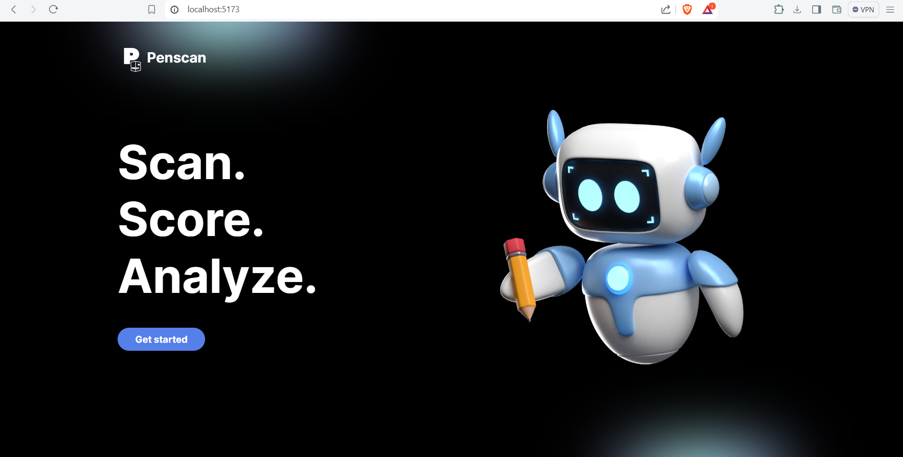
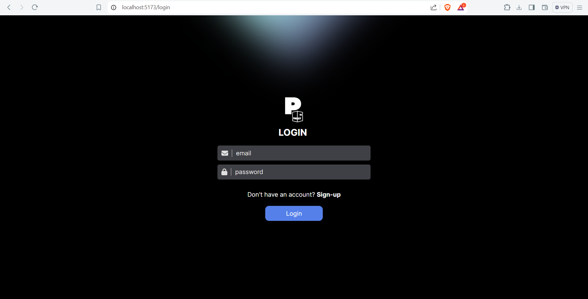
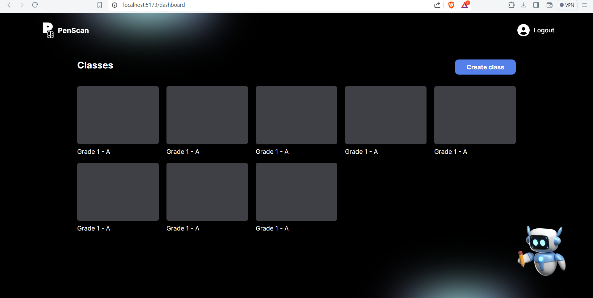
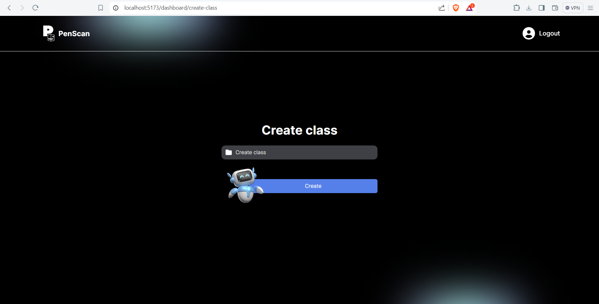

# Running locally

-   Change directory to `client`
-   Run `npm install`
-   After installation, to run on the local server: `npm run dev`

## UIs Only (Logic not yet implemented)

**Common**

-   [x] Landing page
-   [x] Login
-   [ ] Signup

**Teacher**

-   [x] Teacher Dashboard
-   [ ] Add student
-   [ ] Add quiz
-   [ ] Upload image
-   [ ] Scan result
-   [ ] Score ranking & item analysis

**Class**

-   [x] Create Class
-   below are the pages to be shown when a class is clicked
-   [ ] Expanded Class 1 - List of students
-   [ ] Expanded Class 2 - Quizzes

**Student**

-   [ ] Student Dashboard

## Available Pages

**Landing page**

**Login page**

**Teacher Dashboard**

**Create Class**

