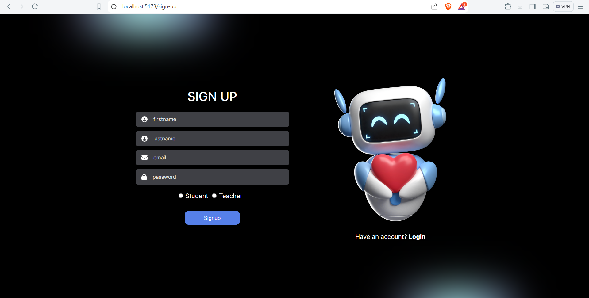
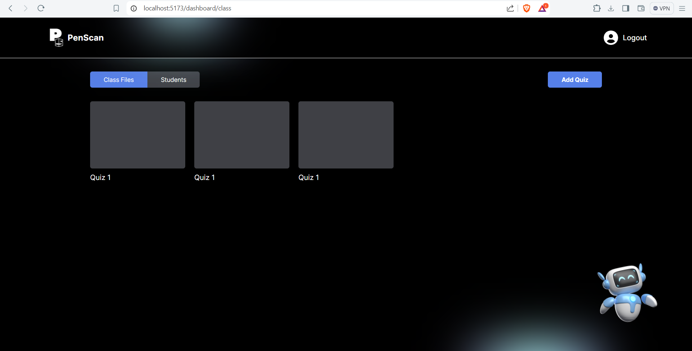
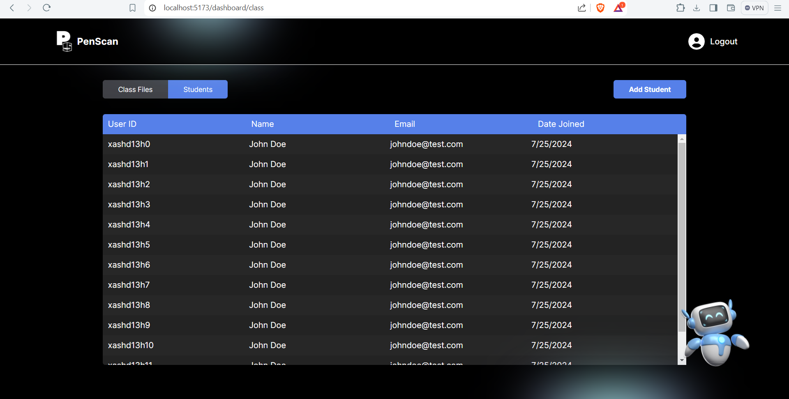
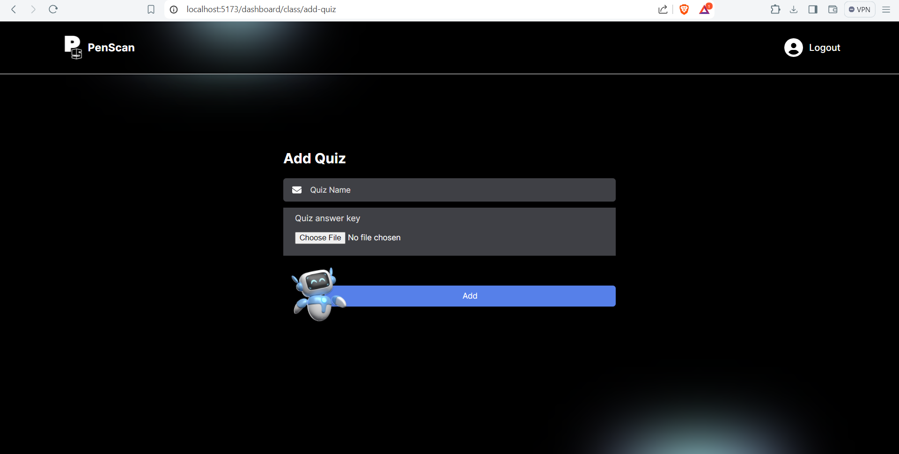
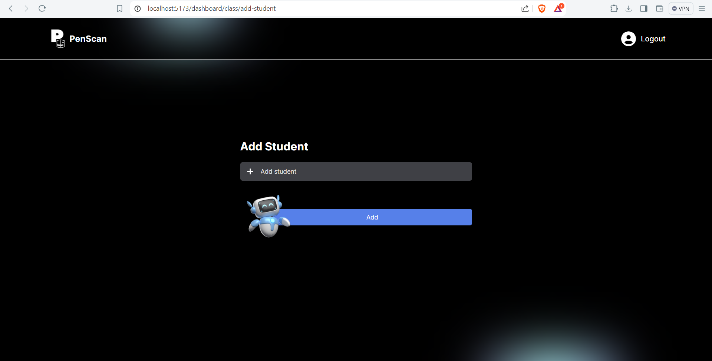

# Running locally

-   Change directory to `client`
-   Run `npm install`
-   After installation, to run on the local server: `npm run dev`

## UIs Only (Logic not yet implemented)

**Integration (Feature) Roadmap**

-   [x] Login
-   [ ] Signup
-   [x] can now get all classes associated with a user
-   [x] can now get a quiz according to class and teacher id
-   [x] can now create a class
-   [ ]
-   [ ]
-   [ ]
-   [ ]
-   [ ]
-   [ ]
-   [ ]
-   [ ]
-   [ ]
-   [ ]
-   [ ]
-   [ ]
-   [ ]
-   [ ]
-   [ ]
-   [ ]
-   [ ]
-   [ ]

**Common**

-   [x] Landing page
-   [x] Login
-   [x] Signup

**Teacher**

-   [x] Teacher Dashboard
-   [x] Add student
-   [x] Add quiz
-   [ ] Upload image
-   [ ] Scan result
-   [ ] Score ranking & item analysis

**Class**

-   [x] Create Class
-   below are the pages to be shown when a class is clicked
-   [x] Expanded Class 1 - List of students
-   [x] Expanded Class 2 - Quizzes

**Student**

-   [ ] Student Dashboard

## Available Pages

**Landing page**

**Login page**

**Signup page**

**Teacher Dashboard**

**Create Class**

**Class Files**

**Class Students**

**Add Quiz**

**Add Student**

